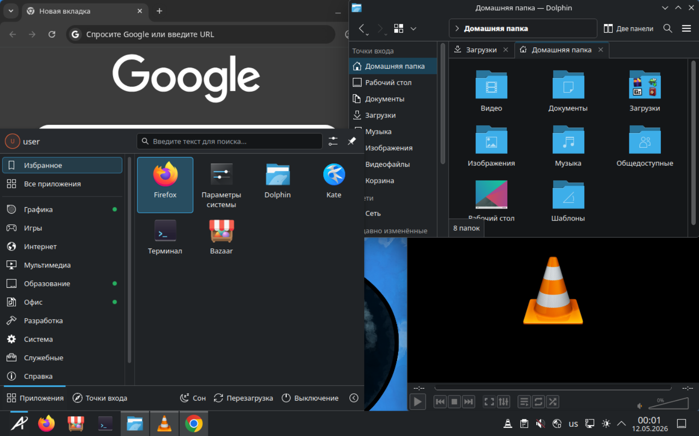

# Oasis &nbsp; [](https://github.com/vladislav-serdyuk/oasis/actions/workflows/build.yml)

A simple, fast, and reliable alternative to Windows. It works with your hardware and runs your favorite apps right out of the box.



## 1. **Important Setup Notes**
* **Username:** During installation, ensure you set your username using **English characters** only.
* **Keyboard Layout:** Use the **Alt + Shift** shortcut to switch between input languages.
* **Background Installation:** Core applications (such as Firefox, Google Chrome, 
  LibreOffice, etc.) will begin installing automatically in the background 
  once the initial setup is complete.

## 2. Running Windows Apps (.exe) — The First Steps

In Oasis, Windows applications run inside protected containers called **Bottles**. Since Oasis is a clean and secure system, your first launch requires a few setup steps:

*   **Step 1: Initial Setup** — Open the **Bottles** app from the menu. If you don't see it yet, refer to **Point 1 (Background Installation)** and wait a few minutes. On its first run, the app will download essential components. This may take **2-10 minutes**. **Do not close the app** until it reaches the main dashboard.
*   **Step 2: Create a Foundation** — Switch to the **"Bottles"** tab at the top and click the **"Create a new Bottle..."** button.
*   **Step 3: Configuration** — Give it a name (e.g., *MyApps*) and select the **"Application"** environment. Click "Create" and wait while the system builds your virtual `C:` drive.
*   **Step 4: Launching** — Go to your `.exe` file in the file manager and **double-click it**. A window will appear asking which bottle to use. Select the one you just created.
*   **Step 5: Adding to Start Menu** — To make your app appear in the Oasis Start Menu:
  1. Open **Bottles** app.
  2. Go to the **"Bottles"** tab and select your bottle.
  3. Scroll down to the **"Programs"** section.
  4. Click the **three dots ⋮** next to your app and select **"Add to Desktop"**.
  5. A system confirmation window will appear — simply **press Enter**.
  6. Now your app is available in the **Start Menu**!

> [!TIP]
> You only need to do steps 1-3 **once**. For all future apps, just double-click them and select your existing bottle. It will work almost instantly!

## 3. Installing Apps — Using Bazaar
Oasis comes with **Bazaar**, a modern app store that makes installing software as easy as on a smartphone. No need to search for installers on websites!

* **Find Anything:** Open Bazaar from your app menu and search for popular apps like Telegram, Discord, Steam, or Spotify.
* **One-Click Install:** Just click "Install," and the app will be ready to use.
* **Stay Updated:** Bazaar automatically checks for updates for all your installed apps and notifies you when they are ready.

*Note: For the best experience, Oasis uses the **Flatpak** format, which keeps your system fast and secure.*

## Installation

> [!WARNING]  
> [This is an experimental feature](https://www.fedoraproject.org/wiki/Changes/OstreeNativeContainerStable), try at your own discretion.

To rebase an existing atomic Fedora installation to the latest build:

- First rebase to the unsigned image, to get the proper signing keys and policies installed:
  ```
  rpm-ostree rebase ostree-unverified-registry:ghcr.io/vladislav-serdyuk/oasis:latest
  ```
- Reboot to complete the rebase:
  ```
  systemctl reboot
  ```
- Then rebase to the signed image, like so:
  ```
  rpm-ostree rebase ostree-image-signed:docker://ghcr.io/vladislav-serdyuk/oasis:latest
  ```
- Reboot again to complete the installation
  ```
  systemctl reboot
  ```

The `latest` tag will automatically point to the latest build. That build will still always use the Fedora version specified in `recipe.yml`, so you won't get accidentally updated to the next major version.

## ISO
[Download](https://drive.google.com/drive/folders/1ePK6MGZuuArni343QLJ4MtxyKrbQCp5H?usp=sharing)

## Verification

These images are signed with [Sigstore](https://www.sigstore.dev/)'s [cosign](https://github.com/sigstore/cosign). You can verify the signature by downloading the `cosign.pub` file from this repo and running the following command:

```bash
cosign verify --key cosign.pub ghcr.io/vladislav-serdyuk/oasis
```
